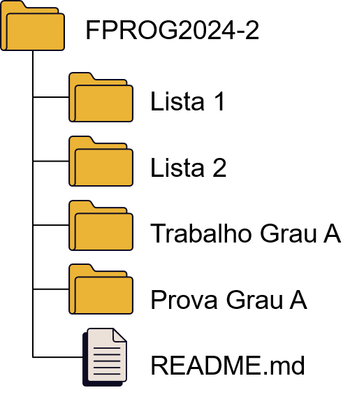
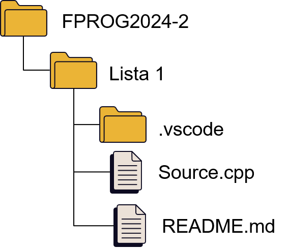

# Algoritmos e Programação: Fundamentos 2024/2

Repositório de exemplos de códigos em C/C++ criado para a Atividade Acadêmica Algoritmos e Programação: Fundamentos dos cursos de Ciência da Computação, Engenharia da Computação e Biologia (Bacharelado) da Unisinos.

Os projetos aqui contidos em geral usam a biblioteca padrão do C (C Standard Library), eventuais dependências serão sinalizadas.

Recomenda-se aos alunos utilizarem a IDE [Visual Studio Code](https://code.visualstudio.com/Download), que possui versão para os sistemas operacionais Windows, Linux (Unix) e MacOS.

Algumas dicas para a instalação do Visual Studio com suporte ao C/C++ podem ser encontradas no link abaixo:
- [Iniciando com o Visual Studio Code e C/C++](VSCode-SETUP.md)

E para a entrega dos exercícios, recomenda-se a criação de um repositório no Github (ou similar) e seguir a seguinte estrutura:

Ou seja, um repositório para a Atividade Acadêmica (disciplina) e cada tarefa em um diretório separado (projeto).
No diretório de cada projeto, além do(s) código(s) fonte, recomenda-se criar um arquivo README.md, conforme este template:
- [Template para o README.md dos projetos](TemplateREADME.md)

## Diretórios de Exemplos

Abaixo estão os diretórios organizados por tema, contendo exemplos de código e explicações detalhadas:

1. [Exemplos Linguagens](https://github.com/fellowsheep/FPROG2024-2/tree/main/Exemplos%20Linguagens)  
   Exemplos introdutórios comparando linguagens como C, C++, Java e Python.

2. [Exemplos Seleção](https://github.com/fellowsheep/FPROG2024-2/tree/main/Exemplos%20Selecao)  
   Estruturas de seleção em C, incluindo `if`, `else`, e operadores ternários.

3. [Exemplos Repetições](https://github.com/fellowsheep/FPROG2024-2/tree/main/Exemplos%20Repeti%C3%A7%C3%B5es)  
   Exemplos de estruturas de repetição como `for`, `while` e `do-while`.

4. [Exemplos Arrays](https://github.com/fellowsheep/FPROG2024-2/tree/main/Exemplos%20Arrays)  
   Introdução a arrays unidimensionais em C.

5. [Exemplos Matrizes](https://github.com/fellowsheep/FPROG2024-2/tree/main/Exemplos%20Matrizes)  
   Trabalhando com matrizes (arrays bidimensionais) em C.

6. [Exemplo Strings](https://github.com/fellowsheep/FPROG2024-2/tree/main/Exemplo%20Strings)  
   Manipulação básica de strings em C e C++.

7. [Exemplos Funções](https://github.com/fellowsheep/FPROG2024-2/tree/main/Exemplos%20Funcoes)  
   Uso de funções em C, incluindo organização com cabeçalhos e bibliotecas.

8. [Exemplo Structs](https://github.com/fellowsheep/FPROG2024-2/tree/main/Exemplo%20Structs)  
   Trabalhando com structs em C, abordando inicialização, exibição e arrays de structs.

---

