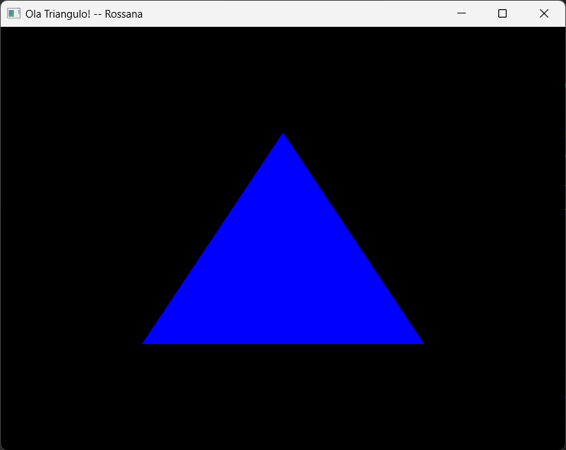

# Tarefa: Lista de Exercícios 1

## Equipe
- Fulano da Silva
- Beltrano de Oliveira

## Pré requisitos e dependências

- Caso o usuário necessite baixar alguma(s) dependência(s), listar ela(s) aqui.
- Indicar para qual(is) sistema(s) operacional(is) é compatível. Ex.: `<Windows / Linux / Mac>`.
- Se for necessária a leitura de um manual de instruções, linká-lo aqui

## Instalação 

> Nesta seção você coloca informações úteis sobre como compilar ou instalar seu programa. 
>
> Por exemplo:

Para instalar o <nome_do_projeto>, siga estas etapas:

Linux e macOS:

```
<comando_de_instalação>
```

Windows:

```
<comando_de_instalação>
```
## Uso

Para usar <nome_do_projeto>, siga estas etapas:

```
<exemplo_de_uso>
```

Adicione comandos de execução e exemplos que você acha que os usuários acharão úteis. 

## Resultados e/ou telas de exemplo

> Se o seu programa tiver saída gráfica, pode colocar um ou mais screenshots. Para inserir imagens você pode carregá-las e referenciá-las ou mesmo copiá-las e colá-las direto no texto (se estiver no Editor do Github).
> 
> 
> 
> ``````
> 
> Se for um programa que gere algum resultado, como tabelas etc, também pode colocar aqui

## Comentários gerais

> Nesta seção você descreve alguma especificidade da tarefa, por exemplo:

Cada exercício da lista está implementado em um arquivo separado.

## Ajustes e melhorias

O projeto ainda está em desenvolvimento e as próximas atualizações serão voltadas para as seguintes tarefas:

- [x] Tarefa 1
- [x] Tarefa 2
- [x] Tarefa 3
- [ ] Tarefa 4
- [ ] Tarefa 5

## Referências e/ou créditos
> Se seu projeto conter assets (imagens, sons etc) que necessitem de licença ou créditos
>
> Se seu projeto é um passo-a-passo de um tutorial, você pode referenciá-lo aqui
>
> Referências em geral que foram úteis para desenvolver o projeto
Para a elaboração deste template, usei como referências
 - [Documentação do Github sobre a linguagem de markdown](https://docs.github.com/en/get-started/writing-on-github/getting-started-with-writing-and-formatting-on-github/basic-writing-and-formatting-syntax)
 - [Este template de _iuricode_](https://github.com/iuricode/readme-template/blob/main/repositorio/exemplo-01.md)

## Colaboradores

Agradecemos às seguintes pessoas que contribuíram para este projeto:
- Huguinho 
- Zezinho
- Luisinho

## Licença

> Esse projeto está sob licença. Veja o arquivo <link_para_licença> para mais detalhes.

> [!TIP]
> Você pode remover ou adicionar seções, de acordo com a necessidade
> 
> Sempre nomeie este arquivo de documentação para README.md e tenha um destes em cada diretório de projeto de tarefa. Assim, ao navegarmos pelo diretório, o texto deste documento aparecerá diretamente.


